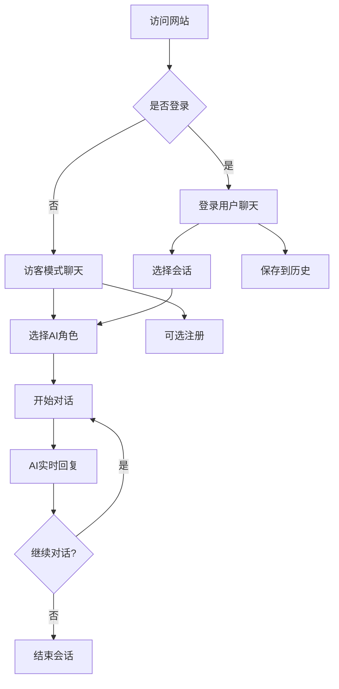

# ChatGalaxy AI聊天平台 - 产品需求文档 (PRD)

## 1. 产品概述

ChatGalaxy是一个基于2025年主流技术栈的智能AI聊天平台，为用户提供多角色AI对话体验。产品支持访客用户直接体验和注册用户的完整功能，通过现代化的Web界面实现与AI的实时交互。

* 产品定位：面向个人用户的AI智能聊天平台，支持多种AI角色切换和实时对话

* 目标用户：AI爱好者、开发者测试用户、求职展示需求者

* 核心价值：提供流畅的AI对话体验，支持聊天记录管理和多角色互动

## 2. 核心功能

### 2.1 用户角色

| 角色   | 注册方式      | 核心权限                |
| ---- | --------- | ------------------- |
| 访客用户 | 无需注册，直接访问 | 可与AI聊天，但无法保存聊天记录    |
| 注册用户 | 邮箱注册      | 可保存聊天记录、管理会话、查看历史对话 |
| 管理员  | 系统分配      | 可管理AI角色配置、用户管理、系统监控 |

### 2.2 功能模块

本产品包含以下核心页面：

1. **聊天主界面**：AI对话窗口、角色切换器、实时消息显示
2. **用户认证页面**：登录表单、注册表单、密码重置
3. **个人中心**：用户信息管理、聊天历史记录、账户设置
4. **角色管理页面**：AI角色选择、角色配置、自定义设置

### 2.3 页面详情

| 页面名称   | 模块名称  | 功能描述                          |
| ------ | ----- | ----------------------------- |
| 聊天主界面  | 对话窗口  | 显示用户与AI的实时对话，支持消息气泡展示、打字状态提示  |
| 聊天主界面  | 角色切换器 | 提供多种AI角色选择，包括助手、创意、专业、轻松等不同性格 |
| 聊天主界面  | 输入框   | 支持文本输入、发送按钮、字符计数、快捷键发送        |
| 用户认证页面 | 登录模块  | 邮箱密码登录、记住登录状态、忘记密码链接          |
| 用户认证页面 | 注册模块  | 用户名邮箱注册、密码强度验证、邮箱验证           |
| 个人中心   | 用户信息  | 显示和编辑用户基本信息、头像上传、昵称修改         |
| 个人中心   | 聊天历史  | 查看所有历史会话、搜索聊天记录、删除会话          |
| 角色管理页面 | 角色选择  | 展示所有可用AI角色、角色描述、切换当前角色        |
| 角色管理页面 | 角色配置  | 自定义角色提示词、调整角色性格参数             |

## 3. 核心流程

### 访客用户流程

用户访问网站 → 直接进入聊天界面 → 选择AI角色 → 开始对话 → 实时接收AI回复 → 可选择注册保存记录

### 注册用户流程

用户登录 → 进入聊天界面 → 创建新会话或继续历史会话 → 选择AI角色 → 进行对话 → 自动保存聊天记录 → 可在个人中心查看历史

### 管理员流程

管理员登录 → 访问管理后台 → 配置AI角色 → 管理用户账户 → 监控系统状态 → 处理用户反馈

## 4. 用户界面设计

### 4.1 设计风格

* **主色调**：#1677FF (现代蓝色) - 主要按钮、链接、品牌标识

* **辅助色**：#F0F8FF (浅蓝色) - 背景色、卡片背景

* **按钮风格**：圆角矩形，悬停效果，渐变背景

* **字体**：系统默认字体，主要文本16px，辅助文本14px

* **布局风格**：卡片式设计，顶部导航，响应式布局

* **图标风格**：线性图标，简洁现代，统一风格

### 4.2 页面设计概览

| 页面名称   | 模块名称  | UI元素                        |
| ------ | ----- | --------------------------- |
| 聊天主界面  | 对话窗口  | 白色背景，消息气泡（用户蓝色，AI灰色），时间戳，头像 |
| 聊天主界面  | 角色切换器 | 卡片式角色展示，头像+名称+描述，选中状态高亮     |
| 聊天主界面  | 输入框   | 圆角边框，发送按钮，字符计数，占位符文本        |
| 用户认证页面 | 登录表单  | 居中卡片，输入框验证，主色调按钮，链接样式       |
| 个人中心   | 导航标签  | 水平标签页，活跃状态指示，图标+文字          |
| 个人中心   | 聊天历史  | 列表样式，会话标题，最后消息预览，时间显示       |

### 4.3 响应式设计

产品采用桌面优先设计，同时适配移动端：

* **桌面端**：1200px以上，三栏布局（侧边栏+主内容+信息栏）

* **平板端**：768px-1199px，两栏布局，侧边栏可收缩

* **移动端**：768px以下，单栏布局，底部导航，支持触摸手势

* **交互优化**：移动端增大点击区域，支持滑动操作，优化输入体验

