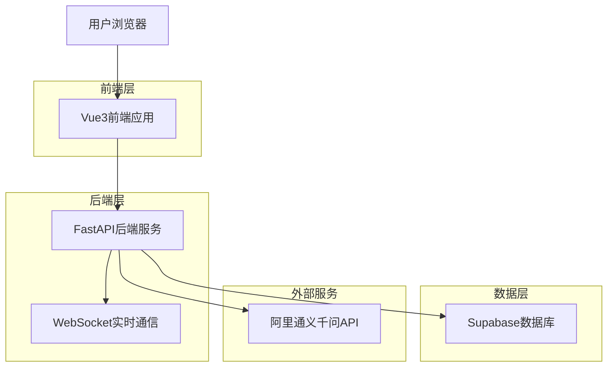
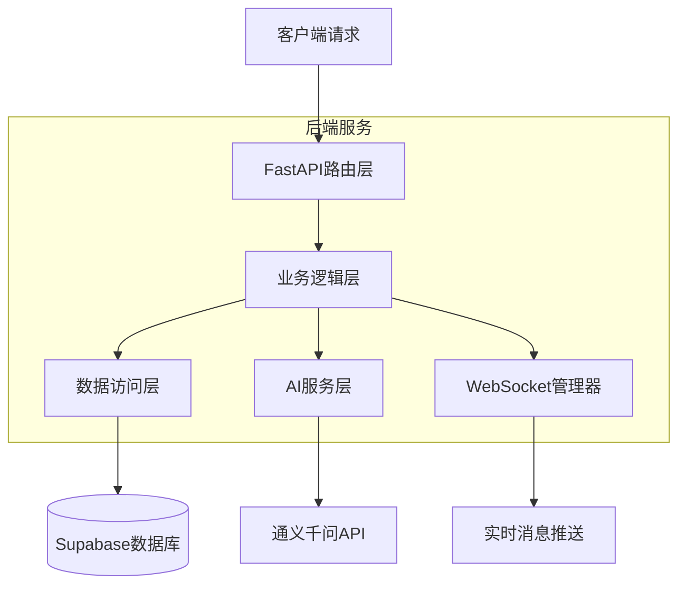
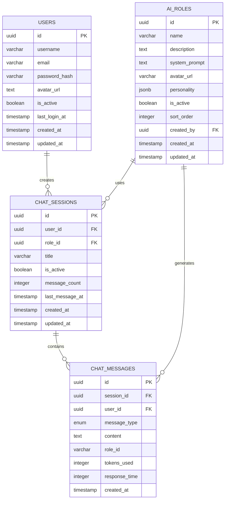

# ChatGalaxy AI聊天平台 - 技术架构文档

## 1. 架构设计

````

## 7. 容器化部署 (Docker)

### 7.1 Docker配置

**前端Dockerfile**
```dockerfile
# 多阶段构建
FROM node:20-alpine AS builder
WORKDIR /app
COPY package*.json ./
RUN npm install -g pnpm && pnpm install
COPY . .
RUN pnpm build

FROM nginx:alpine
COPY --from=builder /app/dist /usr/share/nginx/html
COPY nginx.conf /etc/nginx/nginx.conf
EXPOSE 80
CMD ["nginx", "-g", "daemon off;"]
````

**后端Dockerfile**

```dockerfile
FROM python:3.11-slim
WORKDIR /app
COPY requirements.txt .
RUN pip install --no-cache-dir -r requirements.txt
COPY . .
EXPOSE 8000
CMD ["uvicorn", "app.main:app", "--host", "0.0.0.0", "--port", "8000"]
```

**Docker Compose配置**

```yaml
version: '3.8'
services:
  frontend:
    build: ./frontend
    ports:
      - "3000:80"
    depends_on:
      - backend
  
  backend:
    build: ./backend
    ports:
      - "8000:8000"
    environment:
      - DATABASE_URL=${DATABASE_URL}
      - JWT_SECRET=${JWT_SECRET}
      - DASHSCOPE_API_KEY=${DASHSCOPE_API_KEY}
    depends_on:
      - redis
  
  redis:
    image: redis:7-alpine
    ports:
      - "6379:6379"
```

## 8. 性能优化

### 8.1 前端性能优化

* **代码分割**: Vue3 + Vite动态导入，按路由分包

* **资源优化**: 图片懒加载、WebP格式、CDN加速

* **缓存策略**: HTTP缓存、Service Worker、本地存储

* **打包优化**: Tree-shaking、代码压缩、Gzip压缩

* **渲染优化**: 虚拟滚动、防抖节流、组件懒加载

### 8.2 后端性能优化

* **异步处理**: FastAPI异步路由、数据库连接池

* **缓存机制**: Redis缓存热点数据、查询结果缓存

* **数据库优化**: 索引优化、查询优化、连接池管理

* **API限流**: 基于IP和用户的请求限制

* **WebSocket优化**: 连接池管理、消息队列、心跳检测

### 8.3 数据库性能优化

* **索引策略**: 复合索引、部分索引、全文搜索索引

* **查询优化**: 避免N+1查询、使用EXPLAIN分析

* **分页优化**: 游标分页、索引分页

* **数据归档**: 历史数据定期归档、冷热数据分离

## 9. 监控与日志

### 9.1 应用监控

* **性能指标**: 响应时间、吞吐量、错误率

* **业务指标**: 用户活跃度、消息发送量、AI调用次数

* **系统指标**: CPU、内存、磁盘、网络使用率

* **实时告警**: 异常检测、阈值告警、故障通知

### 9.2 日志管理

**结构化日志格式**

```json
{
  "timestamp": "2025-01-01T12:00:00Z",
  "level": "INFO",
  "service": "chatgalaxy-backend",
  "module": "chat.service",
  "message": "AI response generated",
  "user_id": "user_123",
  "session_id": "session_456",
  "response_time": 1200,
  "tokens_used": 150
}
```

**日志级别**

* **DEBUG**: 详细调试信息

* **INFO**: 一般信息记录

* **WARNING**: 警告信息

* **ERROR**: 错误信息

* **CRITICAL**: 严重错误

### 9.3 安全监控

* **访问日志**: 记录所有API访问

* **异常检测**: 异常登录、频繁请求检测

* **安全事件**: 认证失败、权限违规记录

* **数据保护**: 敏感数据脱敏、审计日志

## 10. 开发最佳实践

### 10.1 代码规范

* **TypeScript**: 严格模式、类型定义完整

* **ESLint**: 代码风格统一、潜在问题检测

* **Prettier**: 代码格式化、团队协作一致性

* **Git Hooks**: 提交前代码检查、自动格式化

### 10.2 测试策略

* **单元测试**: Jest + Vue Test Utils (前端)

* **集成测试**: pytest + FastAPI TestClient (后端)

* **E2E测试**: Playwright 自动化测试

* **API测试**: Postman + Newman 自动化

### 10.3 CI/CD流程

* **代码提交**: Git hooks + 代码检查

* **自动构建**: GitHub Actions + Docker

* **自动测试**: 单元测试 + 集成测试

* **自动部署**: Vercel (前端) + Render (后端)

* **版本管理**: 语义化版本 + 自动标签



## 2. 技术描述

### 2.1 核心技术栈 (2025年最新版本)

* **前端**: Vue3\@3.5.18 + TypeScript\@5.8.0 + Vite\@7.0.6 + Element Plus\@2.10.7 + TailwindCSS\@3.4.17

* **后端**: Python\@3.11+ + FastAPI\@0.104.1 + Pydantic\@2.5.0 + uvicorn\@0.24.0

* **数据库**: Supabase (PostgreSQL\@17)

* **AI服务**: 阿里通义千问API (DashScope SDK\@1.14.1)

* **实时通信**: WebSocket + 自动重连机制

* **认证**: JWT Token + Supabase Auth + 邮箱验证

* **包管理**: pnpm (前端) + pip (后端)

* **部署**: Vercel (前端) + Render (后端) + Supabase (数据库)

### 2.2 开发工具链

* **构建工具**: Vite 7.0+ (HMR热更新、ESBuild优化)

* **代码质量**: ESLint + Prettier + TypeScript严格模式

* **CSS框架**: TailwindCSS 3.4+ (JIT编译、自定义主题)

* **UI组件**: Element Plus 2.10+ (Vue3原生支持)

* **状态管理**: Composition API + Pinia (可选)

* **HTTP客户端**: Axios + 请求拦截器

* **WebSocket**: 原生WebSocket + 心跳检测 + 断线重连

### 2.3 后端架构特性

* **异步框架**: FastAPI (高性能异步处理)

* **数据验证**: Pydantic 2.5+ (类型安全、性能优化)

* **ORM**: SQLAlchemy 2.0+ (异步支持)

* **WebSocket**: FastAPI原生WebSocket支持

* **中间件**: CORS、认证、限流、日志记录

* **缓存**: Redis (可选，用于会话缓存)

* **监控**: 结构化日志 + 性能指标收集

## 3. 路由定义

| 路由        | 用途                     |
| --------- | ---------------------- |
| /         | 首页/聊天主界面，展示AI对话窗口和角色选择 |
| /login    | 登录页面，用户身份验证            |
| /register | 注册页面，新用户账户创建           |
| /profile  | 个人中心，用户信息和设置管理         |
| /history  | 聊天历史记录，查看和管理历史会话       |
| /roles    | 角色管理页面，AI角色选择和配置       |

## 4. API定义

### 4.1 核心API

#### 用户认证相关

**用户注册**

```
POST /api/auth/register
```

请求参数:

| 参数名      | 参数类型   | 是否必需 | 描述            |
| -------- | ------ | ---- | ------------- |
| username | string | true | 用户昵称，3-50个字符  |
| email    | string | true | 用户邮箱地址        |
| password | string | true | 密码，最少8位包含字母数字 |

响应参数:

| 参数名      | 参数类型    | 描述     |
| -------- | ------- | ------ |
| success  | boolean | 注册是否成功 |
| message  | string  | 响应消息   |
| user\_id | string  | 用户唯一标识 |

请求示例:

```json
{
  "username": "张三",
  "email": "zhangsan@example.com",
  "password": "password123"
}
```

**用户登录**

```
POST /api/auth/login
```

请求参数:

| 参数名      | 参数类型   | 是否必需 | 描述     |
| -------- | ------ | ---- | ------ |
| email    | string | true | 用户邮箱地址 |
| password | string | true | 用户密码   |

响应参数:

| 参数名            | 参数类型    | 描述      |
| -------------- | ------- | ------- |
| success        | boolean | 登录是否成功  |
| access\_token  | string  | JWT访问令牌 |
| refresh\_token | string  | 刷新令牌    |
| user           | object  | 用户基本信息  |

#### AI聊天相关

**发送消息**

```
POST /api/chat/send
```

请求参数:

| 参数名         | 参数类型   | 是否必需 | 描述     |
| ----------- | ------ | ---- | ------ |
| message     | string | true | 用户消息内容 |
| session\_id | string | true | 会话唯一标识 |
| role\_id    | string | true | AI角色标识 |

响应参数:

| 参数名          | 参数类型    | 描述         |
| ------------ | ------- | ---------- |
| success      | boolean | 请求是否成功     |
| ai\_response | string  | AI回复内容     |
| message\_id  | string  | 消息唯一标识     |
| tokens\_used | integer | 消耗的Token数量 |

**获取聊天历史**

```
GET /api/chat/history
```

请求参数:

| 参数名         | 参数类型    | 是否必需  | 描述             |
| ----------- | ------- | ----- | -------------- |
| session\_id | string  | false | 会话ID，不传则获取所有会话 |
| page        | integer | false | 页码，默认1         |
| limit       | integer | false | 每页数量，默认20      |

响应参数:

| 参数名      | 参数类型    | 描述     |
| -------- | ------- | ------ |
| success  | boolean | 请求是否成功 |
| messages | array   | 消息列表   |
| total    | integer | 消息总数   |
| page     | integer | 当前页码   |

#### AI角色管理

**获取角色列表**

```
GET /api/roles
```

响应参数:

| 参数名     | 参数类型    | 描述     |
| ------- | ------- | ------ |
| success | boolean | 请求是否成功 |
| roles   | array   | 角色列表   |

角色对象结构:

```json
{
  "id": "assistant",
  "name": "智能助手",
  "description": "专业的AI助手，可以回答各种问题",
  "avatar_url": "https://example.com/avatar.png",
  "system_prompt": "你是一个专业的AI助手..."
}
```

### 4.2 WebSocket实时通信

**连接地址**: `wss://api.chatgalaxy.com/ws/chat/{session_id}?token={jwt_token}`

**消息格式**:

客户端发送:

```json
{
  "type": "user_message",
  "data": {
    "message": "你好，请介绍一下Vue3的新特性",
    "role_id": "tech_expert",
    "timestamp": "2025-01-01T12:00:00Z"
  }
}
```

服务端响应:

```json
{
  "type": "ai_response",
  "data": {
    "message": "Vue3的主要新特性包括Composition API...",
    "role_name": "技术专家",
    "message_id": "msg_123",
    "timestamp": "2025-01-01T12:00:01Z",
    "status": "completed"
  }
}
```

## 5. 服务器架构图



## 6. 数据模型

### 6.1 数据模型定义



### 6.2 数据定义语言

**用户表 (users)**

```sql
-- 创建用户表
CREATE TABLE users (
    id UUID PRIMARY KEY DEFAULT gen_random_uuid(),
    username VARCHAR(50) UNIQUE NOT NULL,
    email VARCHAR(100) UNIQUE NOT NULL,
    password_hash VARCHAR(255) NOT NULL,
    avatar_url TEXT,
    is_active BOOLEAN DEFAULT TRUE,
    last_login_at TIMESTAMP WITH TIME ZONE,
    created_at TIMESTAMP WITH TIME ZONE DEFAULT NOW(),
    updated_at TIMESTAMP WITH TIME ZONE DEFAULT NOW()
);

-- 创建索引
CREATE INDEX idx_users_email ON users(email);
CREATE INDEX idx_users_active ON users(is_active);
CREATE INDEX idx_users_created_at ON users(created_at DESC);

-- 行级安全策略
ALTER TABLE users ENABLE ROW LEVEL SECURITY;
CREATE POLICY "Users can view own data" ON users FOR SELECT USING (auth.uid() = id);
CREATE POLICY "Users can update own data" ON users FOR UPDATE USING (auth.uid() = id);
```

**AI角色表 (ai\_roles)**

```sql
-- 创建AI角色表
CREATE TABLE ai_roles (
    id UUID PRIMARY KEY DEFAULT gen_random_uuid(),
    name VARCHAR(100) NOT NULL,
    description TEXT,
    system_prompt TEXT NOT NULL,
    avatar_url VARCHAR(500),
    personality JSONB,
    is_active BOOLEAN DEFAULT TRUE,
    sort_order INTEGER DEFAULT 0,
    created_by UUID REFERENCES users(id),
    created_at TIMESTAMP WITH TIME ZONE DEFAULT NOW(),
    updated_at TIMESTAMP WITH TIME ZONE DEFAULT NOW()
);

-- 创建索引
CREATE INDEX idx_ai_roles_active ON ai_roles(is_active);
CREATE INDEX idx_ai_roles_sort ON ai_roles(sort_order);

-- 初始数据
INSERT INTO ai_roles (name, description, system_prompt, is_active, sort_order) VALUES
('智能助手', '专业的AI助手，可以回答各种问题', '你是一个专业、友好的AI助手，请用简洁明了的语言回答用户问题。', true, 1),
('创意作家', '富有创意的写作助手', '你是一个富有创意的作家，擅长创作故事、诗歌和各种文学作品。', true, 2),
('技术专家', '专业的技术顾问', '你是一个资深的技术专家，精通各种编程语言和技术框架。', true, 3),
('轻松聊天', '轻松愉快的聊天伙伴', '你是一个幽默风趣的聊天伙伴，喜欢用轻松的语调与用户交流。', true, 4);
```

**聊天会话表 (chat\_sessions)**

```sql
-- 创建聊天会话表
CREATE TABLE chat_sessions (
    id UUID PRIMARY KEY DEFAULT gen_random_uuid(),
    user_id UUID REFERENCES users(id),
    role_id UUID REFERENCES ai_roles(id),
    title VARCHAR(200),
    is_active BOOLEAN DEFAULT TRUE,
    message_count INTEGER DEFAULT 0,
    last_message_at TIMESTAMP WITH TIME ZONE,
    created_at TIMESTAMP WITH TIME ZONE DEFAULT NOW(),
    updated_at TIMESTAMP WITH TIME ZONE DEFAULT NOW()
);

-- 创建索引
CREATE INDEX idx_chat_sessions_user ON chat_sessions(user_id, created_at DESC);
CREATE INDEX idx_chat_sessions_active ON chat_sessions(is_active, last_message_at DESC);

-- 行级安全策略
ALTER TABLE chat_sessions ENABLE ROW LEVEL SECURITY;
CREATE POLICY "Users can view own sessions" ON chat_sessions FOR SELECT USING (auth.uid() = user_id);
CREATE POLICY "Users can create sessions" ON chat_sessions FOR INSERT WITH CHECK (auth.uid() = user_id);
```

**聊天消息表 (chat\_messages)**

```sql
-- 创建消息类型枚举
CREATE TYPE message_type AS ENUM ('user', 'assistant', 'system');

-- 创建聊天消息表
CREATE TABLE chat_messages (
    id UUID PRIMARY KEY DEFAULT gen_random_uuid(),
    session_id UUID REFERENCES chat_sessions(id) ON DELETE CASCADE,
    user_id UUID REFERENCES users(id),
    message_type message_type NOT NULL,
    content TEXT NOT NULL,
    role_id VARCHAR(50),
    tokens_used INTEGER DEFAULT 0,
    response_time INTEGER,
    created_at TIMESTAMP WITH TIME ZONE DEFAULT NOW()
);

-- 创建索引
CREATE INDEX idx_chat_messages_session ON chat_messages(session_id, created_at DESC);
CREATE INDEX idx_chat_messages_user ON chat_messages(user_id, created_at DESC);
CREATE INDEX idx_chat_messages_type ON chat_messages(message_type);

-- 全文搜索索引
CREATE INDEX idx_chat_messages_content_search ON chat_messages USING gin(to_tsvector('chinese', content));

-- 行级安全策略
ALTER TABLE chat_messages ENABLE ROW LEVEL SECURITY;
CREATE POLICY "Users can view own messages" ON chat_messages FOR SELECT USING (auth.uid() = user_id);
CREATE POLICY "Users can create messages" ON chat_messages FOR INSERT WITH CHECK (auth.uid() = user_id);
```

