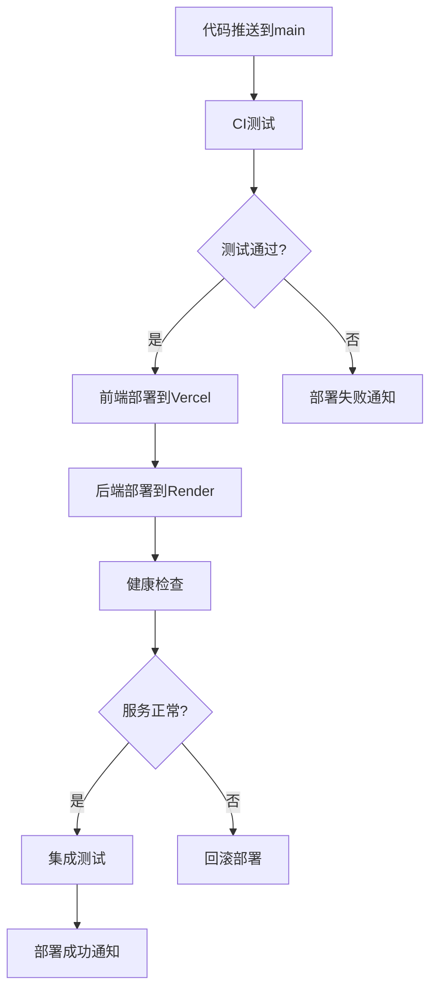

# ChatGalaxy Git Flow 分支管理和部署最佳实践指南

## 📋 概述

本文档详细说明了ChatGalaxy项目的Git Flow分支管理策略、代码审查流程、CI/CD自动化部署和最佳实践规范。

## 🌳 分支管理策略

### 分支结构

```
main (生产分支)
├── develop (开发分支)
│   ├── feature/user-auth (功能分支)
│   ├── feature/chat-interface (功能分支)
│   └── feature/ai-integration (功能分支)
├── hotfix/critical-bug-fix (热修复分支)
└── release/v1.1.0 (发布分支)
```

### 分支说明

#### 🚀 main分支
- **用途**: 生产环境代码，始终保持稳定可部署状态
- **保护规则**: 严格保护，仅允许通过PR合并
- **自动部署**: 推送到main分支自动触发生产环境部署
- **命名规范**: `main`

#### 🔧 develop分支
- **用途**: 主要开发分支，集成所有新功能
- **保护规则**: 要求状态检查通过
- **CI测试**: 每次推送自动运行完整测试套件
- **命名规范**: `develop`

#### ✨ feature分支
- **用途**: 新功能开发，从develop分支创建
- **生命周期**: 功能完成后合并回develop分支并删除
- **命名规范**: `feature/功能描述` (如: `feature/user-authentication`)

#### 🐛 hotfix分支
- **用途**: 紧急修复生产环境问题
- **创建来源**: 从main分支创建
- **合并目标**: 同时合并到main和develop分支
- **命名规范**: `hotfix/问题描述` (如: `hotfix/login-error`)

#### 🎯 release分支
- **用途**: 发布准备，功能冻结和bug修复
- **创建来源**: 从develop分支创建
- **合并目标**: 完成后合并到main和develop分支
- **命名规范**: `release/版本号` (如: `release/v1.1.0`)

## 🔄 开发工作流程

### 1. 新功能开发流程

```bash
# 1. 切换到develop分支并拉取最新代码
git checkout develop
git pull origin develop

# 2. 创建功能分支
git checkout -b feature/new-feature-name

# 3. 开发功能并提交
git add .
git commit -m "feat: 添加新功能描述"

# 4. 推送功能分支
git push origin feature/new-feature-name

# 5. 创建Pull Request到develop分支
# 在GitHub界面创建PR，填写PR模板

# 6. 代码审查通过后合并
# 合并后删除功能分支
git branch -d feature/new-feature-name
git push origin --delete feature/new-feature-name
```

### 2. 热修复流程

```bash
# 1. 从main分支创建热修复分支
git checkout main
git pull origin main
git checkout -b hotfix/critical-issue

# 2. 修复问题并测试
git add .
git commit -m "fix: 修复关键问题描述"

# 3. 推送热修复分支
git push origin hotfix/critical-issue

# 4. 创建PR到main分支（紧急合并）
# 5. 同时创建PR到develop分支（保持同步）
```

### 3. 发布流程

```bash
# 1. 从develop创建发布分支
git checkout develop
git pull origin develop
git checkout -b release/v1.1.0

# 2. 更新版本号和发布说明
# 修改package.json、版本文件等
git add .
git commit -m "chore: 准备v1.1.0发布"

# 3. 推送发布分支
git push origin release/v1.1.0

# 4. 创建PR到main分支
# 5. 合并后创建GitHub Release
# 6. 将发布分支合并回develop分支
```

## 📝 提交信息规范

### Conventional Commits格式

```
<type>[optional scope]: <description>

[optional body]

[optional footer(s)]
```

### 提交类型

- `feat`: 新功能
- `fix`: 修复bug
- `docs`: 文档更新
- `style`: 代码格式调整（不影响功能）
- `refactor`: 代码重构
- `perf`: 性能优化
- `test`: 测试相关
- `chore`: 构建过程或辅助工具变动
- `ci`: CI/CD配置修改

### 提交示例

```bash
# 新功能
git commit -m "feat(auth): 添加JWT用户认证功能"

# 修复bug
git commit -m "fix(chat): 修复WebSocket连接断开问题"

# 文档更新
git commit -m "docs: 更新API文档和部署指南"

# 重构
git commit -m "refactor(components): 重构聊天组件结构"
```

## 🔍 代码审查流程

### Pull Request要求

1. **PR标题**: 使用Conventional Commits格式
2. **描述完整**: 填写PR模板，说明变更内容
3. **测试覆盖**: 确保新功能有对应测试
4. **文档更新**: 如需要，更新相关文档
5. **冲突解决**: 解决所有合并冲突

### 审查检查项

- [ ] 代码符合项目编码规范
- [ ] 功能实现正确且完整
- [ ] 测试用例充分且通过
- [ ] 性能影响可接受
- [ ] 安全性考虑充分
- [ ] 文档更新及时
- [ ] 无明显技术债务

### 审查流程

1. **自动检查**: CI/CD流水线自动运行
2. **人工审查**: 至少1个团队成员审查
3. **修改反馈**: 根据审查意见修改代码
4. **最终批准**: 所有检查通过后合并

## 🚀 CI/CD自动化流程

### 分支触发策略

#### develop分支
- **触发条件**: push到develop分支
- **执行内容**: 
  - 前端：TypeScript检查、代码格式化、单元测试、覆盖率报告
  - 后端：代码检查(ruff)、类型检查(mypy)、安全扫描(bandit)、单元测试
  - 安全：依赖漏洞扫描、代码质量检查

#### main分支
- **触发条件**: push到main分支
- **执行内容**:
  - 完整CI测试流程
  - 自动部署到生产环境
  - 部署后集成测试
  - 部署状态通知

### 部署流程



## 🛡️ 分支保护规则

### main分支保护

```yaml
# GitHub分支保护设置
protection_rules:
  main:
    required_status_checks:
      strict: true
      contexts:
        - "CI Tests"
        - "Security Scan"
        - "Code Quality"
    enforce_admins: true
    required_pull_request_reviews:
      required_approving_review_count: 1
      dismiss_stale_reviews: true
      require_code_owner_reviews: false
    restrictions:
      users: []
      teams: []
    allow_force_pushes: false
    allow_deletions: false
```

### develop分支保护

```yaml
develop:
  required_status_checks:
    strict: true
    contexts:
      - "CI Tests"
  enforce_admins: false
  required_pull_request_reviews:
    required_approving_review_count: 0
  allow_force_pushes: false
  allow_deletions: false
```

## 📊 质量保证

### 代码质量指标

- **测试覆盖率**: ≥80%
- **代码重复率**: ≤5%
- **圈复杂度**: ≤10
- **技术债务**: 控制在可接受范围

### 自动化检查

1. **代码格式**: Prettier (前端) + Black (后端)
2. **代码检查**: ESLint (前端) + Ruff (后端)
3. **类型检查**: TypeScript (前端) + MyPy (后端)
4. **安全扫描**: Snyk + Bandit + Safety
5. **依赖审计**: npm audit + pip-audit

## 🔧 开发环境配置

### 本地开发设置

```bash
# 1. 克隆仓库
git clone git@github.com:Soberis/ChatGalaxy.git
cd ChatGalaxy

# 2. 切换到develop分支
git checkout develop

# 3. 安装依赖
# 前端
cd frontend
pnpm install

# 后端
cd ../backend
pip install -r requirements.txt

# 4. 配置环境变量
cp .env.example .env
# 编辑.env文件，填入必要配置

# 5. 启动开发服务器
# 前端
pnpm run dev

# 后端
python -m uvicorn app.main:app --reload
```

### Git Hooks配置

```bash
# 安装pre-commit hooks
pip install pre-commit
pre-commit install

# 配置.pre-commit-config.yaml
# 包含代码格式化、lint检查等
```

## 📈 监控和维护

### 分支健康度监控

- **分支数量**: 控制活跃分支数量
- **合并频率**: 定期合并避免冲突
- **代码审查**: 跟踪审查效率和质量
- **部署成功率**: 监控部署稳定性

### 定期维护任务

1. **每周**: 清理已合并的功能分支
2. **每月**: 更新依赖包和安全补丁
3. **每季度**: 评估和优化CI/CD流程
4. **每半年**: 审查分支策略和工作流程

## 🚨 应急处理

### 生产环境问题处理

1. **立即响应**: 确认问题影响范围
2. **快速修复**: 创建hotfix分支修复
3. **紧急部署**: 跳过常规审查流程
4. **事后分析**: 分析问题原因和改进措施

### 回滚策略

```bash
# 1. 快速回滚到上一个稳定版本
git checkout main
git revert HEAD
git push origin main

# 2. 或者回滚到指定提交
git reset --hard <stable-commit-hash>
git push --force-with-lease origin main
```

## 📚 最佳实践总结

### 开发最佳实践

1. **小而频繁的提交**: 保持提交粒度适中
2. **清晰的提交信息**: 使用规范的提交格式
3. **及时同步**: 定期从develop分支拉取更新
4. **功能分支短生命周期**: 避免长期存在的分支
5. **完整的测试**: 确保新功能有充分测试

### 协作最佳实践

1. **积极的代码审查**: 认真审查每个PR
2. **建设性的反馈**: 提供有价值的改进建议
3. **及时响应**: 快速响应审查请求
4. **知识分享**: 通过审查过程分享知识
5. **持续改进**: 定期优化工作流程

### 部署最佳实践

1. **自动化优先**: 最大化自动化程度
2. **渐进式部署**: 使用蓝绿部署或金丝雀发布
3. **监控告警**: 完善的监控和告警机制
4. **快速回滚**: 准备快速回滚方案
5. **文档维护**: 保持部署文档更新

---

**注意**: 本指南应根据团队规模和项目需求进行调整。定期评估和优化工作流程，确保其适应项目发展需要。